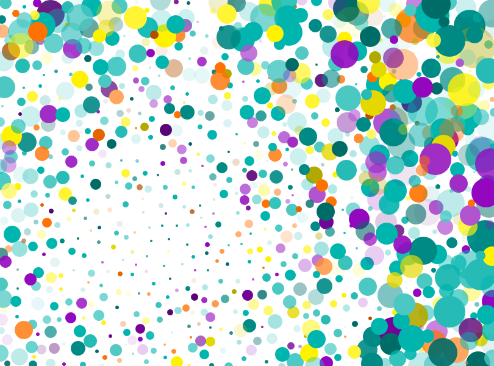
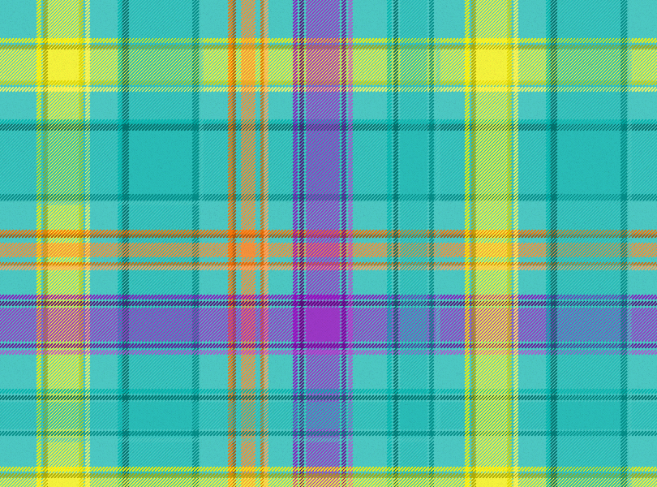

# My website

This is my personal website. Here I present some personal projects, thoughts on my blogs and information about how to find me. In particular I hightlight things I have worked on in the past in the `projects` section and elaborate on the areas/fields in which I have some sort of mastery.
If you want to get in touch just send me a message via Twitter(X), Mastodon or Gmail.

## Dependencies

### Install Ruby

- In Arch
  - `sudo pacman -S ruby base-devel`
- For other OS
  - [Other linux distro instructions](https://jekyllrb.com/docs/installation/other-linux/)

#### Option 1: Bundle

Once you have Ruby, install the `bundle` gem with `gem install bundle`. Then get all the dependencies with: `bundle`.

#### Option 2: Jekyll

- `gem install jekyll bundler`
  - After installation, add Ruby gem binaries to the path of your OS if requested in terminal
  - Troubleshooting
    - I had a problem with the gem `webrick`. It was solved installing the gem via `gem install webrick`
      - [Source of solution](https://programmerah.com/solved-jekyll-install-error-cannot-load-such-file-webrick-loaderror-39104/)

## Usage

Run the following command in the terminal:

```bash
jekyll server --baseurl '' --livereload
```

If you have created the page with `jekyll new website_name` you need to use instead:

```bash
bundle exec jekyll serve --livereload
```

## Color palette

The color palette is mostly based in pastel and vibrant colors. Base color is teal. Orange is used as the complementary color. Purple and yellow in their hue/brightness variations are part of the palette too.

### Color Palette by Paletton.com

#### Palette URL: http://paletton.com/#uid=43h1j0kw0DljNJppqFjD8szFqmi

\*\*\* Primary color:

```CSS
   shade 0 = #00B5AE = rgb(  0,181,174) = rgba(  0,181,174,1) = rgb0(0,0.71,0.682)
   shade 1 = #4CC8C3 = rgb( 76,200,195) = rgba( 76,200,195,1) = rgb0(0.298,0.784,0.765)
   shade 2 = #27BBB6 = rgb( 39,187,182) = rgba( 39,187,182,1) = rgb0(0.153,0.733,0.714)
   shade 3 = #008A85 = rgb(  0,138,133) = rgba(  0,138,133,1) = rgb0(0,0.541,0.522)
   shade 4 = #006C68 = rgb(  0,108,104) = rgba(  0,108,104,1) = rgb0(0,0.424,0.408)
```

\*\*\* Secondary color (1):

```CSS
   shade 0 = #FFF200 = rgb(255,242,  0) = rgba(255,242,  0,1) = rgb0(1,0.949,0)
   shade 1 = #FFF761 = rgb(255,247, 97) = rgba(255,247, 97,1) = rgb0(1,0.969,0.38)
   shade 2 = #FFF535 = rgb(255,245, 53) = rgba(255,245, 53,1) = rgb0(1,0.961,0.208)
   shade 3 = #E4D800 = rgb(228,216,  0) = rgba(228,216,  0,1) = rgb0(0.894,0.847,0)
   shade 4 = #B2A900 = rgb(178,169,  0) = rgba(178,169,  0,1) = rgb0(0.698,0.663,0)
```

\*\*\* Secondary color (2):

```CSS
   shade 0 = #9307BF = rgb(147,  7,191) = rgba(147,  7,191,1) = rgb0(0.576,0.027,0.749)
   shade 1 = #B254D0 = rgb(178, 84,208) = rgba(178, 84,208,1) = rgb0(0.698,0.329,0.816)
   shade 2 = #A02EC5 = rgb(160, 46,197) = rgba(160, 46,197,1) = rgb0(0.627,0.18,0.773)
   shade 3 = #730497 = rgb(115,  4,151) = rgba(115,  4,151,1) = rgb0(0.451,0.016,0.592)
   shade 4 = #5A0376 = rgb( 90,  3,118) = rgba( 90,  3,118,1) = rgb0(0.353,0.012,0.463)
```

\*\*\* Complement color:

```CSS
   shade 0 = #FF7100 = rgb(255,113,  0) = rgba(255,113,  0,1) = rgb0(1,0.443,0)
   shade 1 = #FFA761 = rgb(255,167, 97) = rgba(255,167, 97,1) = rgb0(1,0.655,0.38)
   shade 2 = #FF8E35 = rgb(255,142, 53) = rgba(255,142, 53,1) = rgb0(1,0.557,0.208)
   shade 3 = #E46500 = rgb(228,101,  0) = rgba(228,101,  0,1) = rgb0(0.894,0.396,0)
   shade 4 = #B24F00 = rgb(178, 79,  0) = rgba(178, 79,  0,1) = rgb0(0.698,0.31,0)
```

#### Samples

{: .image_fit}

{: .image_fit}

## Credits

This repository was initially created using the `technical portfolio framework` [TechFolio](http://techfolios.github.io) as template.

---

Juan Rios @ 2025
