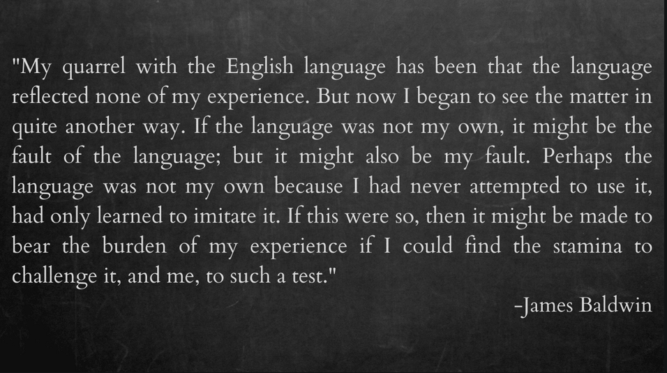

 Language is an important human invention. As a tool for communication allows us to express a wide range of aspects of the human experience, as well as to tell stories about pasts that could have been or futures that would be. Language is one of those skills of our existence that, when used for good can help us make sense of the world. 
 I recently read an article about a law institution in the United States, [The center on privacy and technology at Georgetown law](https://techpolicy.press/artifice-and-intelligence/) which decided to rethink the way they use a set of words common in the tech world: AI, machine learning and Artificial Intelligence. In their opinion, these words have been hijacked by corporations and institutions which profit from these technologies while referring to concepts and contexts that don't reflect reality as it is. One of the aspects lost in translation have been the acutely representation of an idea as complex as intelligence. Intelligence, they argue, has been distilled by the machinery of markets and corporations to single purpose metrics and models that while serving as evidence of progress and new lines of machine capability in the field, don't reflect the holistic nature of intelligence. One example of this is seen when some leaders of the field unscrupulously mention that their new X model, trained with Y technology and Z sets of data, is able to reason. The same people have also came to declare, without proof, that a potential future where machines are able to manifest intelligence in a general is now a reality, just needing more data to feed the monster, to grow it faster.
  
Those two examples make me really think about how biased humans can become when the set of beliefs defining their worldview are questioned. Many or those researchers have been working on these topics for years, some for decades and now, being at the top of the research chain (in the field of intelligence and computational capabilities research), are totally immerse in their own world of hype and unlimited capital, unable to recognize the limits of their invention and line of work. The current manifestation of these technologies ignore essential aspects of humanity: emotions, authenticity, and ultimately the unlimited number of factors defining the experience of existing in the world. A hidden dilemma here, is how research in AI tends to talk about a distinction between the real and the imitation as a distraction, when what we ought to do is using such distinction as a north star, taking us to the places where living matters, where our collecting experience existing in the world is rich and meaningful. I leave the following idea from James Baldwin, an African American writer with really interesting optics about the world. This quote was taken from an essay of his tittled [Why I stopped hating Shakespeare](https://www.folger.edu/sites/default/files/Why%20I%20Stopped%20Hating%20Shakespeare_JamesBaldwin.pdf) It made me think a lot about the power of language, and how we use it in the world as we go. Maybe it could do the same to you:

- [Artifice and intelligence](https://techpolicy.press/artifice-and-intelligence/)
- [Why I stopped hating Shakespeare: Essay by James Baldwin](https://www.folger.edu/sites/default/files/Why%20I%20Stopped%20Hating%20Shakespeare_JamesBaldwin.pdf)

