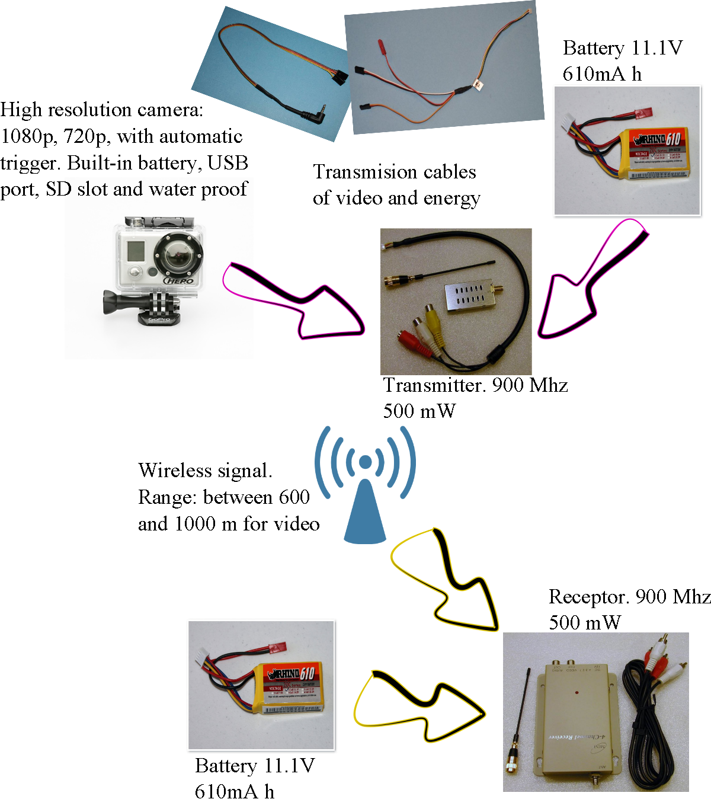
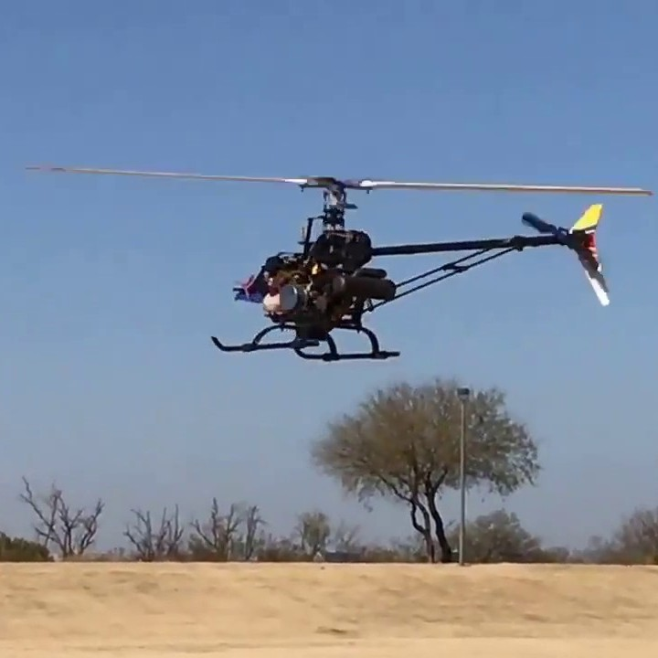

  
  

I worked for a couple of years in the design and construction of the avionics box of a Mini Robot Aerial Vehicle. One of the aspects I worked with was the integration of a video system to take videos and photos from the air. The designed system can be divided in two subsystems: the onboard system (video sender), and the ground system (video receptor). The image at the right shows the components integrated to construct this system, which was attached to the mini-helicopter XCell Gas Graphite to take aerial video.

More information can be found in the following document (in Spanish): <a href="../images/aerial/colibri.pdf"><i class="large github icon"></i>Colibri report</a>