## Computer vision

### Advanced lane line tracking

  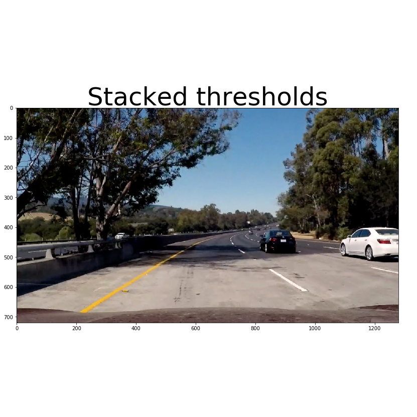
  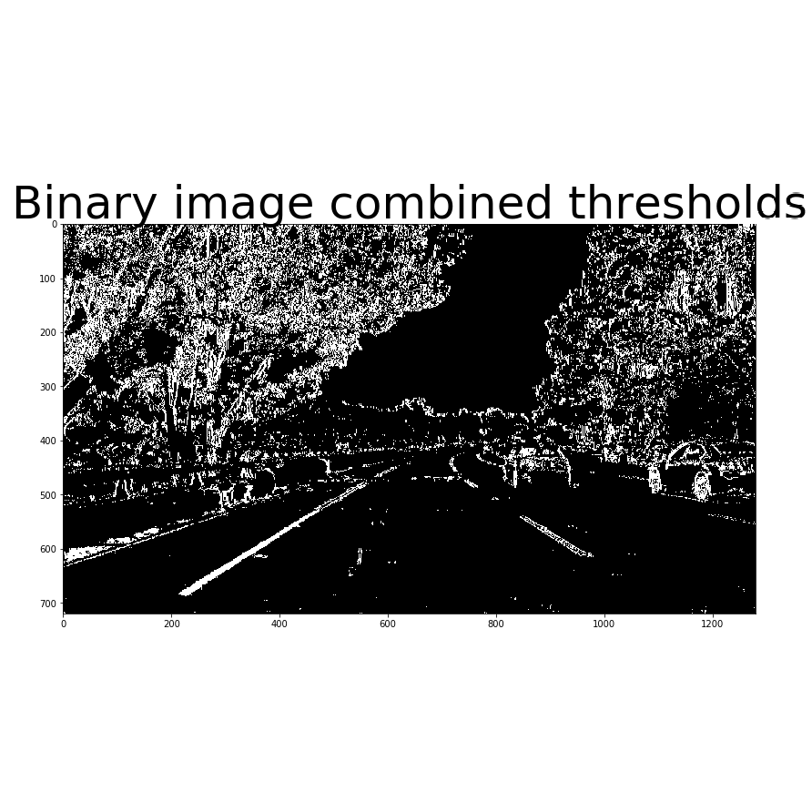
  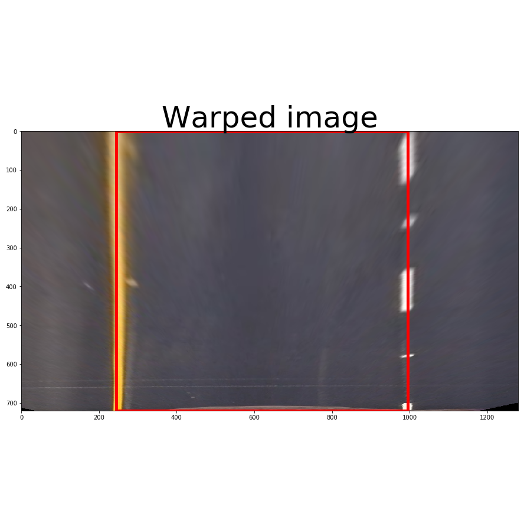
  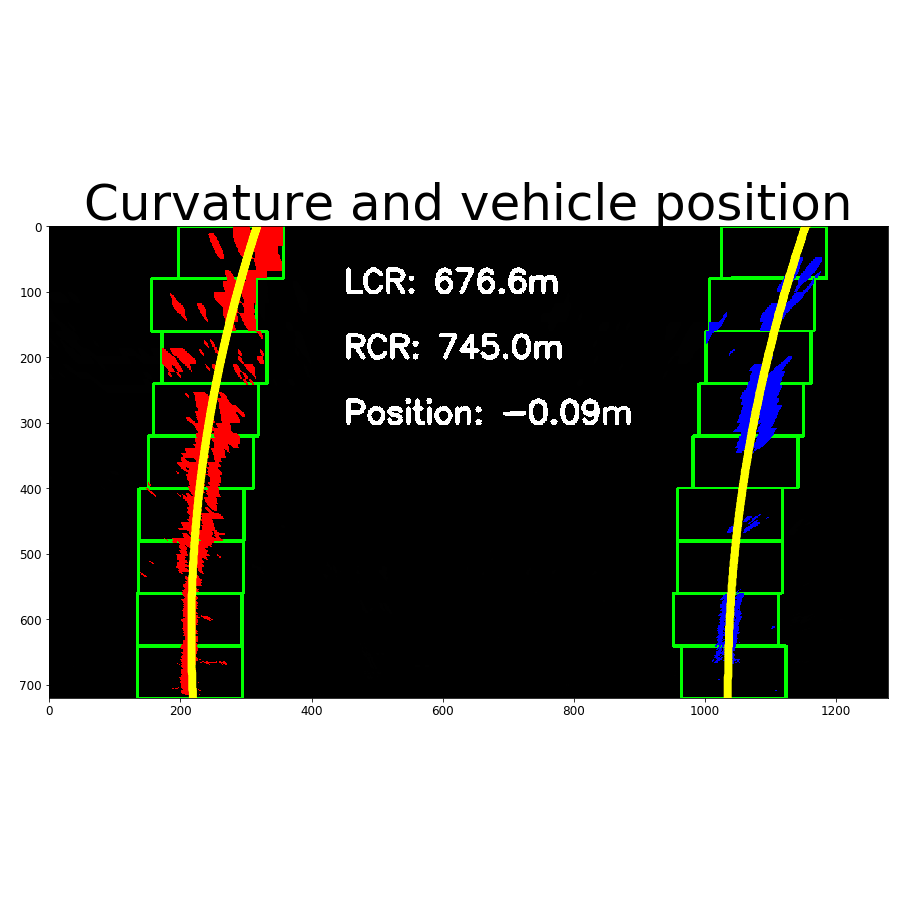

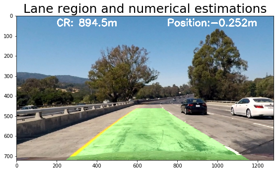

In this project, I developed a software pipeline to identify the lane boundaries of a road in a video. A series of steps are followed to identify the lanes:

<ol style="text-align: justify !important;"> 
<li> Compute the camera calibration matrix and distortion coefficients given a set of chessboard images. </li> 
<li> Apply a distortion correction to raw images. </li> 
<li> Use color transforms, gradients, etc., to create a thresholded binary image. </li> 
<li> Apply a perspective transform to rectify binary image ("birds-eye view"). </li> 
<li> Detect lane pixels and fit to find the lane boundary. </li> 
<li> Determine the curvature of the lane and vehicle position with respect to center </li> 
<li> Warp the detected lane boundaries back onto the original image. </li>
<li> Output visual display of the lane boundaries and numerical estimation of lane curvature and vehicle position. </li></ol>
The final result is shown in the right hand side image. Steps 3, 4, 5 and 6 are illustrated in the collection of images above.

Source: <a class="hlink" href="https://github.com/juandarr/Advanced-lane-line-tracking"><i class="large github icon"></i>Advanced lane line tracking.</a>

### Traffic signed classifier with CNN

  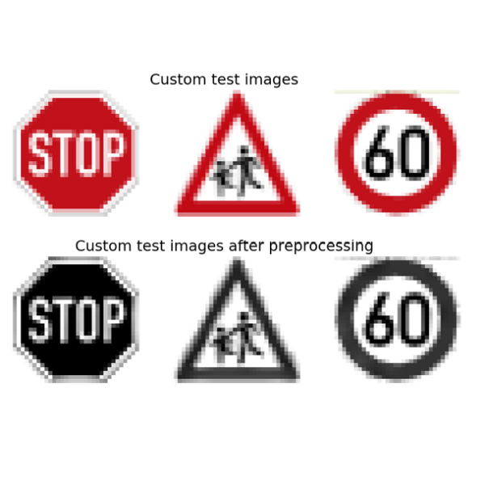

An iterative approach was followed during this project to reach a satisfactory solution. The first architecture used was Lenet 5. This network has two convolutional and max-pooling sets. It also lacks of dropout implementation and includes three fully connected layers (including the final output layer). As far as first experiments go, no data augmentation was implemented and the data preprocessing used was grayscaling and image normalization. The performance achieved during this stage was about 88, 89 percent.

After this initial setup, several hyperparameters were modified, the batch size was increased to 128, 256 and 512, the number of epochs was changed between 100 and 200 and I tried with different learning rates. The best ones were the values below 0.005. The architecture of the neural network was also modified. The depth of the convolutional layer was also modified, increases in their depth gave better accuracies during training and validation. The initial convolutional layers of the Lenet implementation had a depth of 6 and 16 respectively. This value was increased to 16 and 32, and finally to 32 and 64. Additional changes were defined in the output of the fully connected layers: I went from the values for the Lenet implementation, 120-84-43, to a bigger number of nodes 800-200-43 and 1000-500-43. After increases in the depth of the convolutional layer and output sizes of the fully connected layers, we got improvements in validaction accuracy between 1% and 3%. The final model results were:
<ul>
   <li> Training set accuracy of  98.4%.</li>
   <li> Validation set accuracy of  97.2%.</li>
   <li> Test set accuracy of 94.9%.</li>
</ul>

Source: <a class="hlink" href="https://github.com/juandarr/German-traffic-sign-classifier"><i class="large github icon"></i>Traffic sign classifier.</a>

### Behavioral cloning

  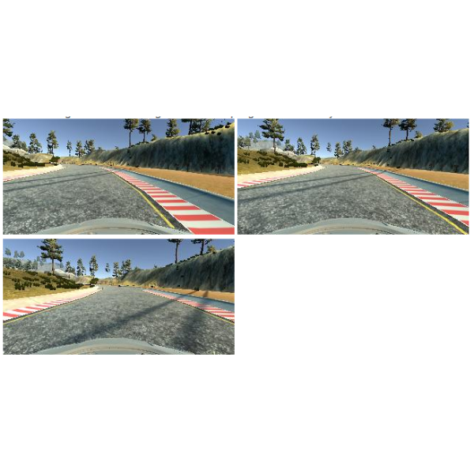

The overall strategy for deriving a model architecture was to follow an iterative method. Initially started with a simple fully connected layer. The results were not attractive since the vehicle was turning left and right in a constant basis and the moving was far from smooth. After this, I made a transition to a LeNet like network with three convolutional layers and just one fully connected layer at the end in addition to the output. During model training, the training loss was decreasing while validation loss changed randomly around a fixed value. In simulation testing, the car was able to drive in the straight road but could not complete the curves in several scenarios. The driving style was also far from smooth.

The best result was achieved with an architecture similar to the one recommended in the video lectures. My final model consists of a deep convolutional neural network with a set of five convolutions at the beginning and three fully connected layers in addition to the output. The first 3 convolutional layers use a filter of size 5x5, stride of 2x2 and have depths of 24, 32 and 48 respectively. The other 2 convolutional layers use a filter of 3x3, stride of 1x1 and have a depth of 64 (both). To avoid overfitting, validation sets were defined as the 20% of the training set in each epoch. Dropout layers were also used in the convolutional layers. The batch size was set to 32 and Adam optimizer was used to train the model, so the learning rate was not tuned manually (model.py line 94). The activation function RELU was used in the convolutional layers. No activation function was used in the fully connected layers.

Source: <a class="hlink" href="https://github.com/juandarr/Behavioral-cloning"><i class="large github icon"></i>Behavioral cloning.</a>

## Sensor fusion and localization

### Extended kalman filter

In this project I implemented an enhanced Kalman Filter to estimate the state of a moving object of interest with noisy lidar and radar measurements. The C++ code creates a server with uWebSockets and connects to a client simulator built on the Unity engine. The simulator shows the moving object, laser/radar/estimation data (as red dots, blue circles and green triangles respectively) and RMSE data for position and velocity values in the x and y axis.

  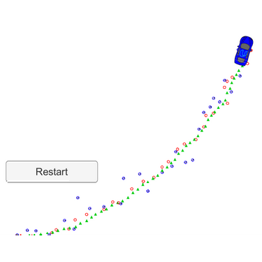

Source: <a class="hlink" href="https://github.com/juandarr/Extended-kalman-filter"><i class="large github icon"></i>Extended kalman filter.</a>

### Particle filter

  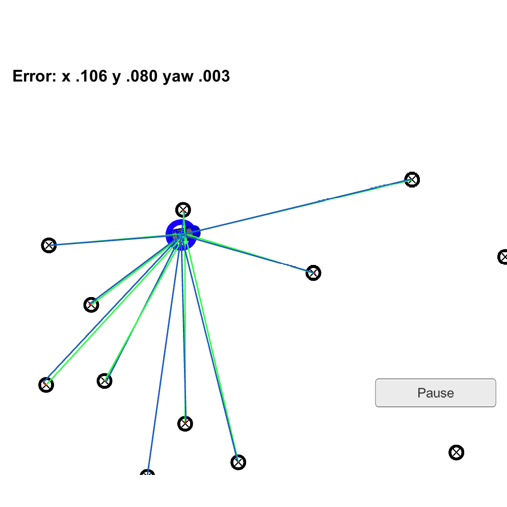

In this project a robot has been kidnapped and transported to a new location. Luckily it has a map of this location, a (noisy) GPS estimate of its initial location, and lots of (noisy) sensor and control data. A two dimensional particle filter implemented in C++ is used to localize the robot from this data. The filter works in the context of a set of landmark data from a map and some initial localization information (similar to what a GPS would provide). At each time step the filter receives observation and control data. This data is then used to perform a set of steps: initilization, prediction, update and resampling.

Source: <a class="hlink" href="https://github.com/juandarr/Particle-filter"><i class="large github icon"></i>Particle filter.</a>

## Path planning

  

The path planning algorithm implemented in this project allows the control of an autonomous vehicle in a high-speed highway by enabling behavior selection and trajectory generation features. A class was created containing the main properties (<em>current lane</em>, <em>changing lane</em> status, <em>too_close</em>, <em>too_close_left</em> and <em>too_close_right</em>) and methods required to reach a set of requirements that must be met, for instance:
<ul>
    <li>The car drives according to a speed limit of 50 miles per hour.</li>
    <li>Max acceleration and jerk don't exceed 10 m/s2 and 10 m/s3 respectively.</li>
    <li>The car doesn't have collisions.</li>
    <li>The car stays in its lane, except for the time when it is changing lanes.</li>
    <li>The car is able to change lanes.</li>
    <li>The car is able to drive in simulation at least 4.32 Miles without incident, meaning any of the previous conditions are satisfied.</li>
</ul>

Source: <a class="hlink" href="https://github.com/juandarr/Path-planning"><i class="large github icon"></i>Path planning.</a>

## PID Controller 

  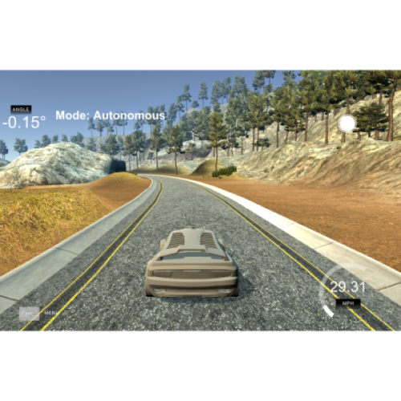

Summary in progress. In the mean time you can explore the Github source.

Source: <a class="hlink" href="https://github.com/juandarr/PID-controller"><i class="large github icon"></i>PID controller.</a>

## Self driving car pipeline

  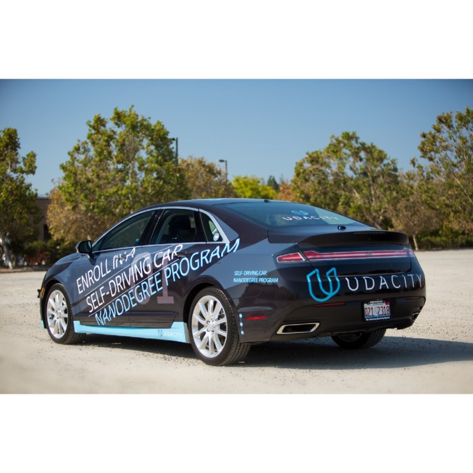

Summary in progress. In the mean time you can explore the Github source.

Source: <a class="hlink" href="https://github.com/juandarr/Self-driving-car-Capstone"><i class="large github icon"></i>Self driving car architecture.</a>
