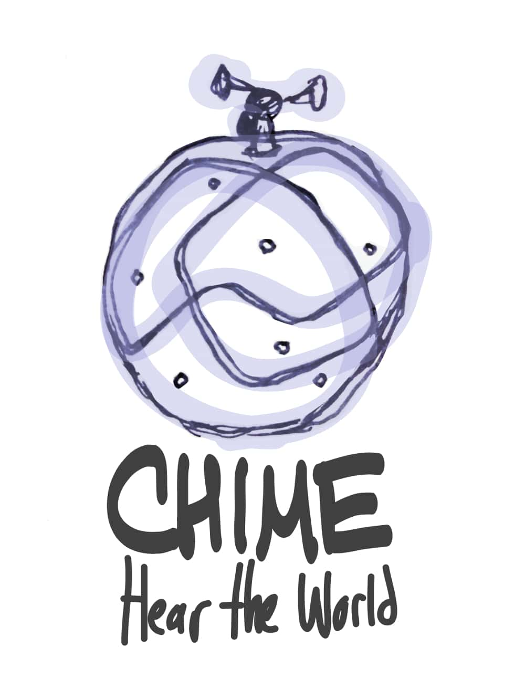

  
  
  
  

Chime is a musical device to create music from motion and spatial gestures. It uses artificial intelligence and gesture recognition to generate music from multidimensional sensor input. The idea came up the day before a hackathon in Atlanta, Georgia, when a group of four people originated the idea in a bar during a brainstorming session where topics such as music, hardware, artificial intelligence and environment collided with each other. We won the first place with this idea, giving us access to an incubator based in Sillicon Valley and travel tickets for a two week pitch training in San Francisco during September, 2013.

This prototype was built using the [Arduino](https://www.arduino.cc/) (variations MEGA 2560 and nano were used in different versions of the prototype) and a set of sensors providing input data from the environment: sonar, temperature, humidity, accelerometer and gyroscope. The data was captured by the arduino board and sent wirelessly via Bluetooth to a music engine we built in Python for PC. The music engine is based on the [Pyo](https://github.com/belangeo/pyo) module for Python, a library for audio signal processing.

Source: <a href="https://github.com/juandarr/chime"><i class="large github icon"></i>Chime</a>