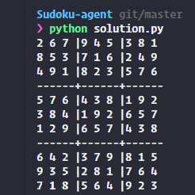
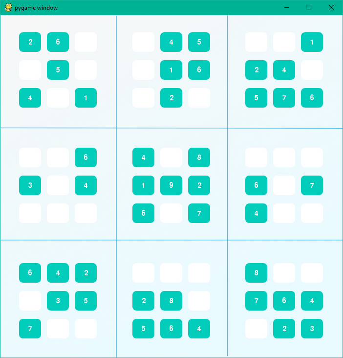
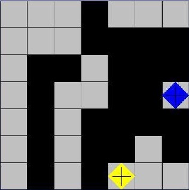
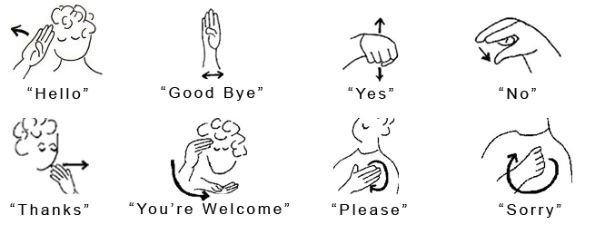

## Dog breed classifier

  
  

In this initial project, I built a simple AI using Constraint Propagation and Search to solve Sudoku puzzles. Contraint propagation strategies are extended to solve Diagonal Sudokus, and implement advanced Sudoku strategies such as the Naked Twins strategy. The sytstem prints the Sudoku solved on the terminal prompt and when the pygame dependencies are satified will show in a user interface how the solver fills the gaps in each new iteration.

Source: <a class="hlink" href="https://github.com/juandarr/Sudoku-agent"><i class="large github icon"></i>Sudoku agent.</a>

## Time series prediction and text generation

This project involves the implementation of a game playing environment and an agent that will try to maximize its probability to win while minimizing the probability of the oponent to win in an special format of the game isolation. Isolation is a game where an agent wins when the opponent has no more free space around it while the agent is free to move in at least one direction. In this format only `L` shaped movements are allowed. The main algorithm used in the adversarial tree search is `minimax`. `Minimax` is optimized with add-ons such as an `heuristic` score, `iterative deepening` and the addition of `alpha-beta prunning`.

Source: <a class="hlink" href="https://github.com/juandarr/Adversarial-game-isolation"><i class="large github icon"></i>Adversarial game isolation.</a>

## Machine translation

The planner consists in a computer program that is able to reach new, logical conclusions from a given set of initial facts. In this case an airplane is located in an initial airport, and the planner is expected to take from its initial point to a `goal`, in the form of a destination airport. A set of operations are allowed. The main tools implemented to design the intelligent planner are propositional logic, search algorithms such as `A*`, BFS, DPS and axioms.

Source: <a class="hlink" href="https://github.com/juandarr/Planning-search"><i class="large github icon"></i>Planning search.</a>

## Deepdream

This project explored the use of probabilistic inferential models to calculate the probability of certain events ocurring. In particular we use Hidden Markov Models to recognize American sign language given a sequence of movements, intermediate states are unobserved and a previous knowledge of expected sequences (but not of their probabilities). This final project is part of the section covering `bayesian networks`, `conditional probability` and `Bayes' rule`.

Source: <a class="hlink" href="https://github.com/juandarr/Sign-language-recognizer"><i class="large github icon"></i>Sign language recognizer.</a>
