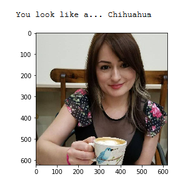
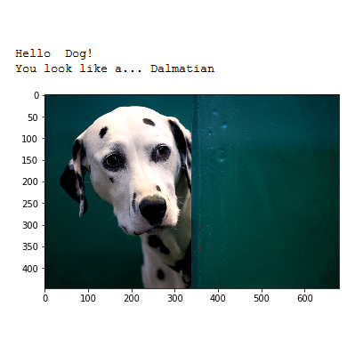
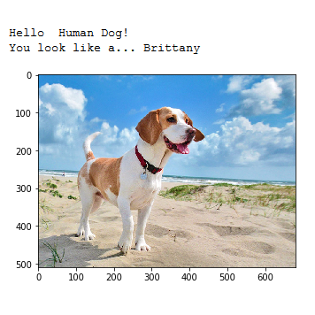
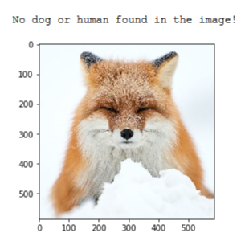
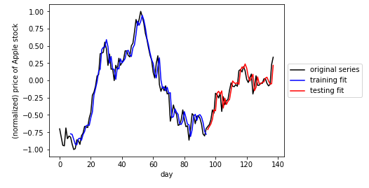
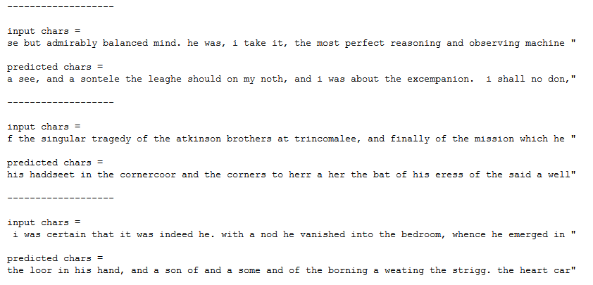
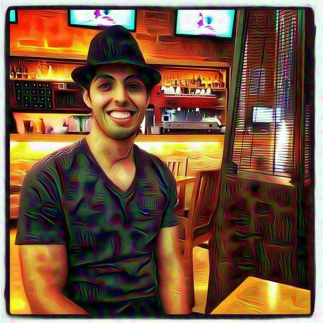
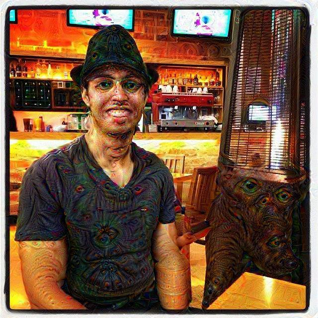

## Dog breed classifier

  
  
  
  

This project involves the creation of a software pipeline to classify dog breed from user-supplied images in a webapp. It uses Convoluational Neural Networks for classification. I used transfer learning to use a more robust previously trained classifier, VGG16. Given an image of a dog, the pipeline will identify an estimate of the canine’s breed. If supplied an image of a human, the code will identify the resembling dog breed.

Source: <a class="hlink" href="https://github.com/juandarr/Dog-breed-classifier"><i class="large github icon"></i>Dog breed classifier.</a>

## Time series prediction and text generation

In the time series part the code performs time series prediction using a Recurrent Neural Network regressor. In particular I re-created the stock price of Apple forecasted (or predicted) 7 days in advance. The RNNs were implemented using Keras. The particular network architecture employed for the RNN is known as Long Term Short Memory (LSTM), which helps significantly avoid technical problems with optimization of RNNs.

In the text generation part I implemented a popular Recurrent Neural Network (RNN) architecture to create an English language sequence generator capable of building semi-coherent English sentences from scratch by building them up character-by-character. This requires a substantial amount of parameter tuning on a large training corpus (at least 100,000 characters long). In particular for this project I used a complete version of Sir Arthur Conan Doyle's classic book The Adventures of Sherlock Holmes.

Source: <a class="hlink" href="https://github.com/juandarr/Time-series-and-text-generation"><i class="large github icon"></i>Time series and text generation.</a>

## Machine translation

In this project I built a deep neural network that functions as part of an end-to-end machine translation pipeline. The completed pipeline accepts English text as input and return the French translation and uses three distinct models that we compare in performance: (1) Using a vanilla RNN, (2) using embedding and (3) with bidirectional RNNs. As an example, the best model translates `he saw an old yellow truck` as `il a vu un vieux camion jaune PAD PAD PAD PAD PAD PAD PAD PAD PAD PAD PAD PAD PAD PAD`, which is correct. `PAD` defines spaces available for words. The training accuracy of the final model is about `98%` while the validation accuracy is about `97%`.

Source: <a class="hlink" href="https://github.com/juandarr/Machine-translation"><i class="large github icon"></i>Planning search.</a>

## Deepdream

  
  
  

Deep dream is created with Convoluation Neural Networks. Once a CNN has been trained for image recognition, the network can also be run in reverse. In this context the network adjusts the original image slightly so that a given output neuron (e.g. the one for faces or certain animals) yields a higher confidence score. This can be used for visualizations to understand the emergent structure of the neural network better, and is the basis for the Deepdream concept. I played with this concept for a while. The first time I saw it in 2015 I was blown away. Here are some examples of my exploration. At the top there are two different activations  for an original picture at the left. At the right hand side you see the result of applying the algorithm iteratively on its own outputs and some zooming after each iteration. We get an endless stream of new impressions, exploring the set of things the network knows about.

Source: <a class="hlink" href="https://github.com/juandarr/Deep-dream"><i class="large github icon"></i>Deep dream.</a>
