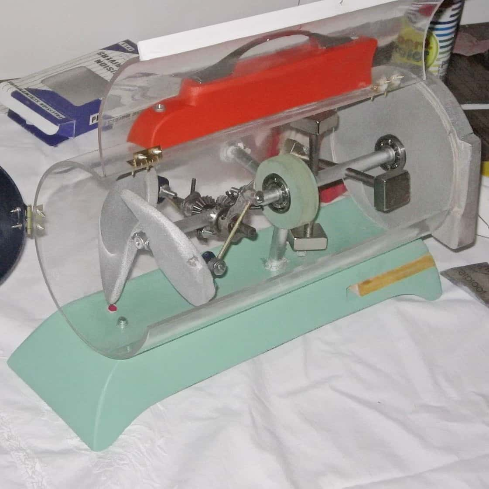

  
  
  
  

The goal of this project was to design and build a device able to convert mechanical energy obtained from the air flow into eletrical energy. In this project I learned basic concepts about mechanism design and applied it in conjuntion with physics and engineering concepts. Faraday induction explains the physical phenomenon behind energy generation: electrical energy can be obtained aplying the Faraday's law in which the induced electromotive force (EMF or electric potential) in any closed circuit is equal to the time rate of change of the magnetic flux through the circuit.

A flux of air enters through a semiclosed cilindrical cavity, and according to its force and the wings' inclination, the rotor moves along with four magnets. The relative movement between these magnets and the coil generates an induced electromotive force which moves the electrons of the metallic material and then, produces an electrical current (electrical energy generation). A video that exemplify the mechanical movement of the system, and the idea behind this project is shown next:

    <iframe class="resp-iframe" src="https://www.youtube.com/embed/--vAqtKbqyM?rel=0&amp;showinfo=0" frameborder="0" allow="autoplay; encrypted-media" gesture="media"  allowfullscreen></iframe>

