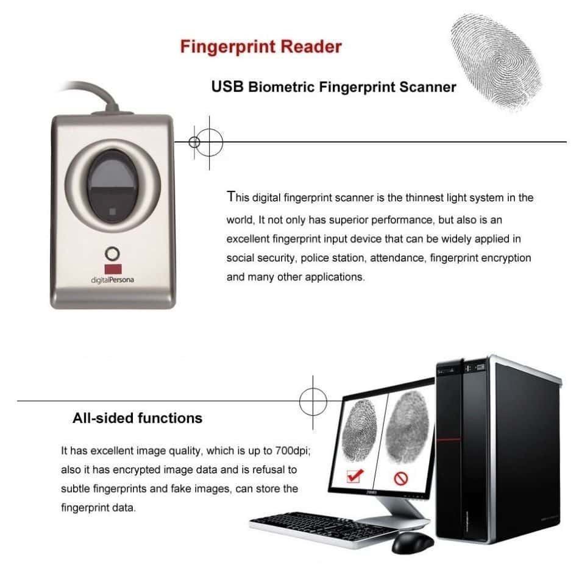

I designed and build a biometrics time punching solution for companies to register the arrival/departure of their employees from the workplace. The solution is composed of three diferent developments: a hardware device connected to a windows computer, a desktop app written in Java and Swing (for user interface) storing information locally via a SQLite database and a webapp created with Angular, which stores information globally in a backend based on mySQL. The storage architecture defines local databases to store biometric data in local computers attached to specific fingerprint sensors, a global database in the cloud is sincronized to the local ones and accumulates the data according to the company ID. The webapp includes features to visualize and manage the punching data. This system was developed as one of  the features required to create a more complete solution aimed to manage the work force in small and medium size companies.

More information can be found in the following link: <a href="https://github.com/juandarr/App_biometrics"><i class="large github icon"></i>webapp for biometrics management</a>
