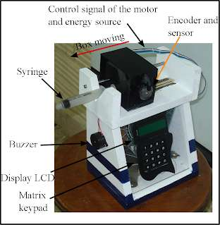
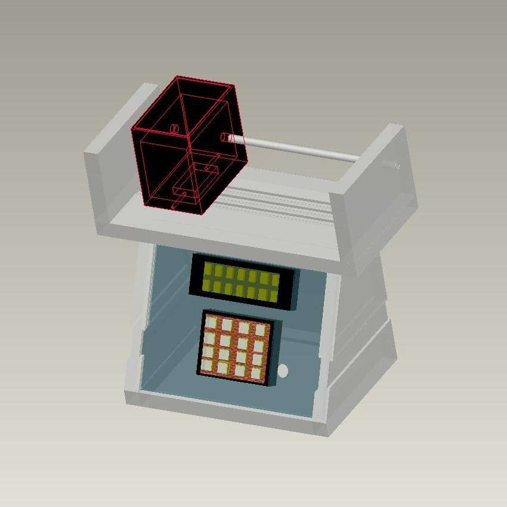
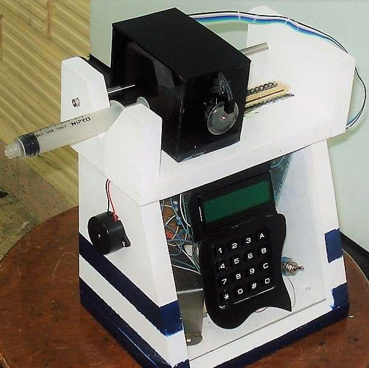
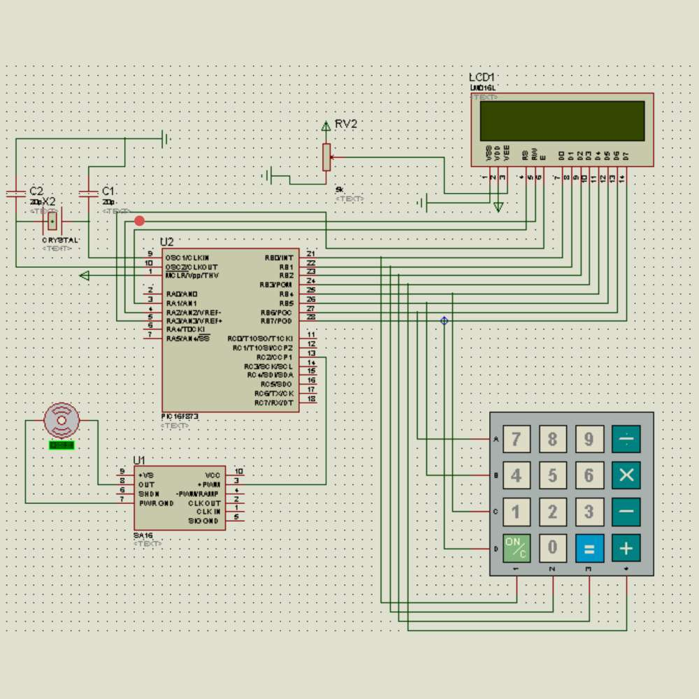

  
  
  

An infusion system infuses fluids, medications or nutrients into a patient's circulatory system. Infusion pumps can administer fluids in ways that would be impractically expensive or unreliable if performed manually by nursing staff.
The development of this system involved the use of embedded systems (microcontrollers), sensors (liquid volume and rotor speed) and mechanical design. Programming skills were required to write all the code behind every function in the device and hardware integration.

The system was initally modeled in Pro Engineer. Then it was built. Functionally, the piston syringe is pressed and moved slightly by a black box with a dc motor in its interior. The motor speed is sensed with an enconder which provides a signal to control the amount of energy feeding the motor, gaining control over the fluid volume ejected in the syringe output. The system features a visualization system (display) and a matrix keypad for input commands such as the desired volumen or infusion periodicity. A buzzer provides alert sounds to indicate the init of the system, system malfunction, among other indicators.

