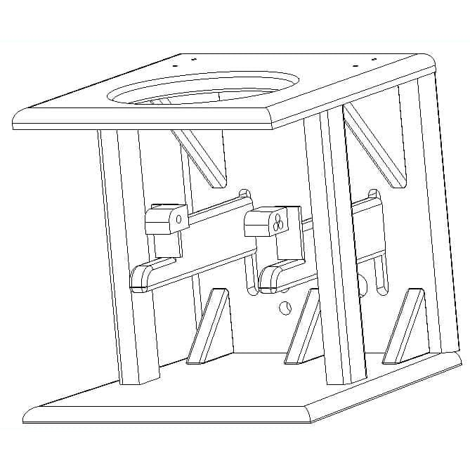
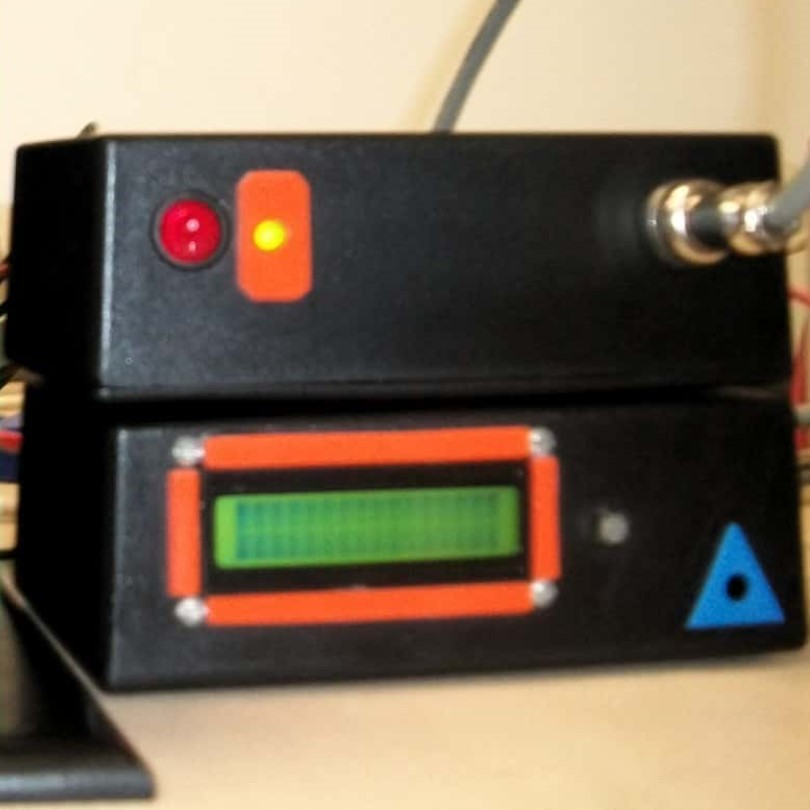

  
  
  
  

I designed this magnetic levitation system aplying all the engineering concepts learned in my major, including analog and digital circuit design, conceptual design (the whole and the relationship of the parts at different levels: mechanical, electrical, interaction among subsystems,etc.), firmware programming with C/C++, control design and implementation. The final result is shown in the following video, you can see the levitation of objects of different materials, geometry, mass and dimension. One interesting fact about the system is that it was designed to levitate a spherical body of fixed mass and located at a fixed equilibrium position respect to the coil core, however this limitation, levitation can be achieved for considerable changes in mass, shape and other parameters.

<iframe width="560" height="315" src="https://www.youtube.com/embed/pp8TWlxj1Ng?rel=0&amp;showinfo=0" frameborder="0" allow="autoplay; encrypted-media" allowfullscreen></iframe>

