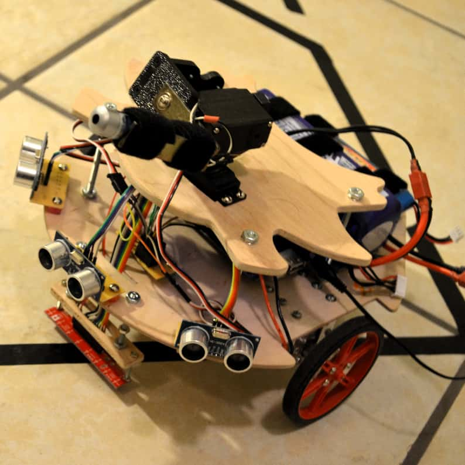
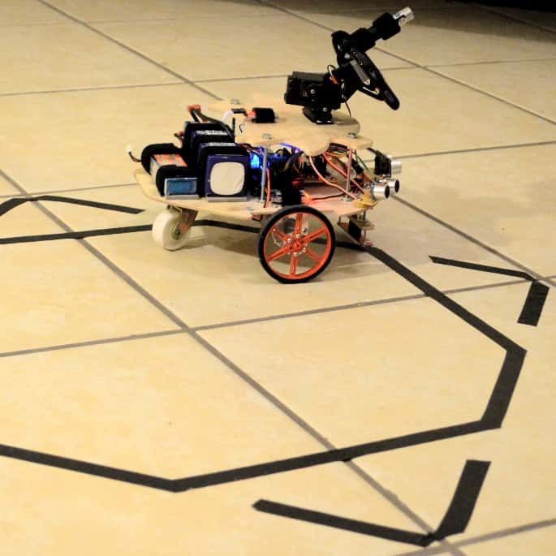

  
  
  
  

I designed and built an autonomous wheeled robot to surveil physical spaces using an android camera and pattern recognition algorithms for face, object and motion recognition. The system also features a set of ultrasonic modules for obstacle avoidance and an array of IR sensors to detect patterns in flat surfaces such as black lines over a white surface, which is used here to design the robot's line tracking capabilities.

## Functional description

As far as functionality goes, the robot can follow lines, perform object tracking and avoid obstacles.  The priority order of the actions done by the robot is as follows:

<ol style="text-align:left !important;">
  <li>Avoid obstacles</li>
  <li>Object recognition</li>
  <li>Line tracking</li>
  <li>Move forward</li>
</ol>

Normally the robot will move forward until it finds lines to follow or a colored object (green color in the demo video) or obstacles to avoid. In the latter case, the robot will turn around and if there are no more obstacles ahead will choose among actions 2,3 and 4 as the next action to follow. When the robot's camera detects and object, it will stop and the device will start to follow the object with the attached pan/tilt system. Once the object of attention is in the center ofr the frame the robot will use a laser (also attached and controlled by the pan/tilt system) to point over whatever is ahead and an alarm will go on, indicating gun fire. The object tracking software uses the built-in camera of an android smartphone with OpenCV and Python. When the robot detects lines to follow it will try to stay on track unless there is an obstacle ahead. The robot body actuation is achieved by two 9V DC motor controlled by an H-bridge connected to an arduino board. This system moves a simple two wheeled platform with an extra support caster wheel in the back.

## Demos
### Collision avoidance

    <iframe class="resp-iframe" src="https://www.youtube.com/embed/o0P5m1t8Hhg?rel=0&amp;showinfo=0" frameborder="0" allow="autoplay; encrypted-media" gesture="media"  allowfullscreen></iframe>

### Object recognition

    <iframe class="resp-iframe" src="https://www.youtube.com/embed/LN0dzoi4bZw?rel=0&amp;showinfo=0" frameborder="0" allow="autoplay; encrypted-media" gesture="media"  allowfullscreen></iframe>

### Line tracking

    <iframe class="resp-iframe" src="https://www.youtube.com/embed/wj9VCHaooy4?rel=0&amp;showinfo=0" frameborder="0" allow="autoplay; encrypted-media" gesture="media"  allowfullscreen></iframe>

### Manual operation mode

    <iframe class="resp-iframe" src="https://www.youtube.com/embed/zWjKY17BtYQ?rel=0&amp;showinfo=0" frameborder="0" allow="autoplay; encrypted-media" gesture="media"  allowfullscreen></iframe>

### Pan/tilt system testing

    <iframe class="resp-iframe" src="https://www.youtube.com/embed/QPomn0754iE?rel=0&amp;showinfo=0" frameborder="0" allow="autoplay; encrypted-media" gesture="media"  allowfullscreen></iframe>

You can learn more at the following link: <a class="hlink" href="https://www.mil.ufl.edu/5666/papers/IMDL_Report_Fall_12/Final%20Reports/Juan_Rios/Juan_Rios.pdf"><i class="file pdf outline icon"></i>Robot final report</a>.

