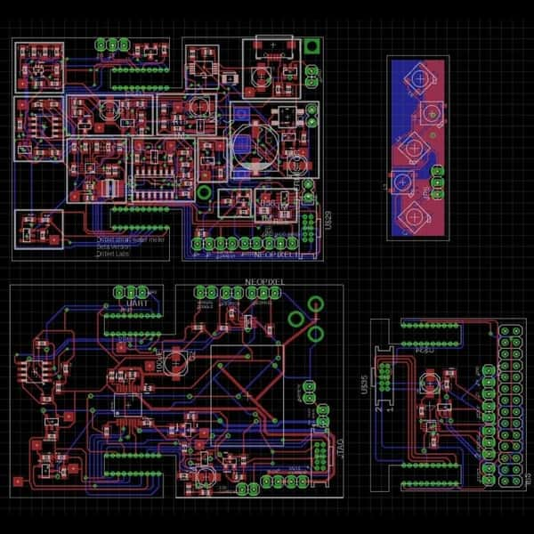

  
  
  
  

I was part of the foundational team of a startup located in the Cambridge Innovation Center. Leaded the conception, design and development of a smart water meter, vale and hub as a solution for business to control and monitor the water consumptions in their facilities. Working from the perspectiva of hardware and firmware development I took the project from prototype to manufacturing (pilot tests) phase in a period of time of about one and a half years. The data was collected in the cloud using AWS and mongoDB. A webapp was designed with meteor to work in pair with the hardware for analytics, management and visualization of water consumption and device status.

Also, as a member of the Cambridge innovation center I was exposed and actively involved to Boston’s startup ecosystem, learning best practices and tools to thrive in an entrepreneurial and highly demanding environment.

More information here: <a class="hlink" href="https://techcrunch.com/2014/01/08/driblets-smart-water-meter-wants-to-track-your-home-water-usage/"><i class="bookmark outline icon"></i>Driblet</a> 
