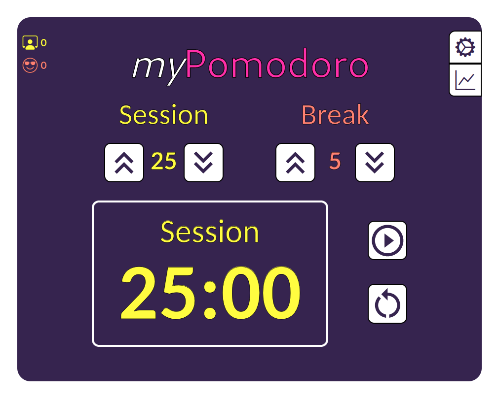
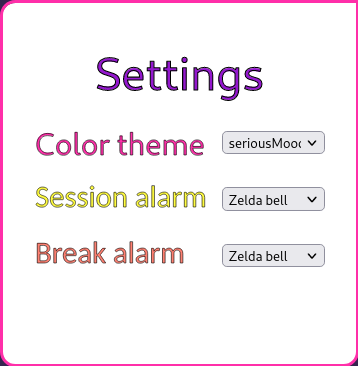
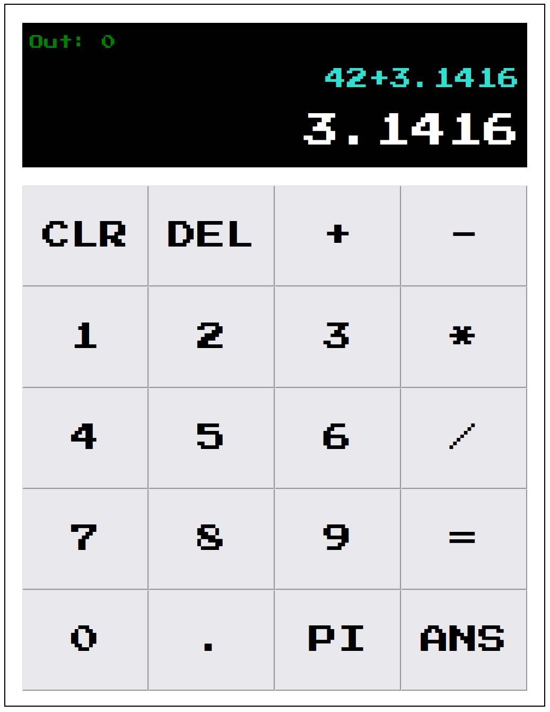
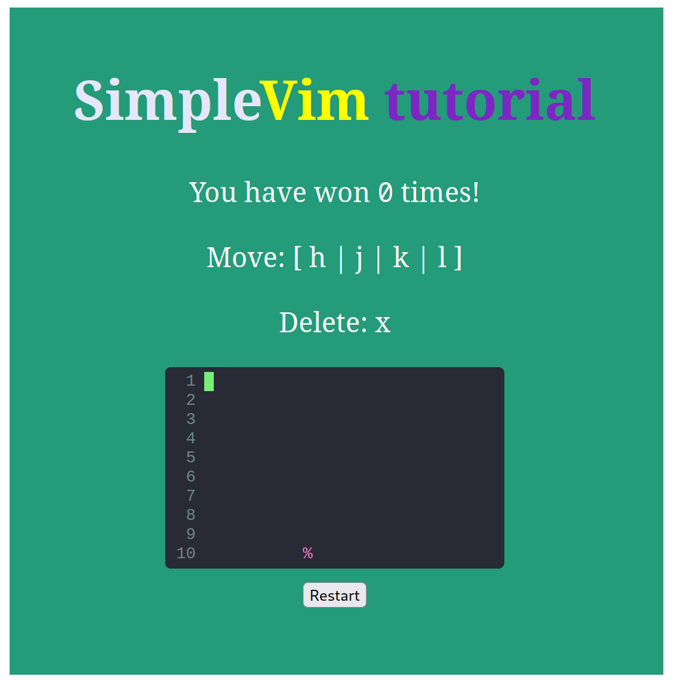
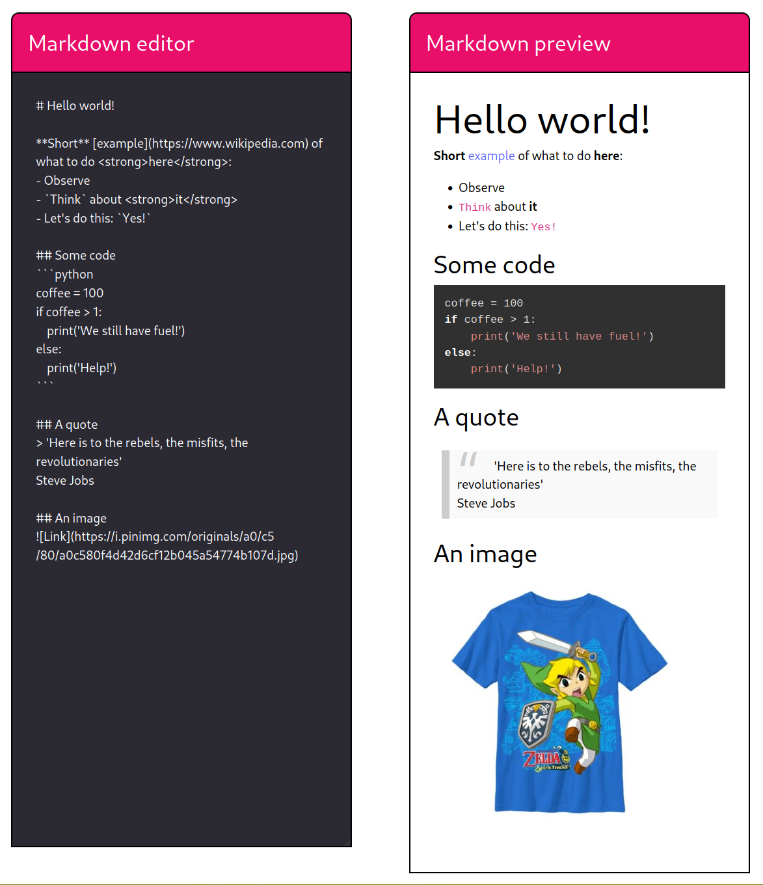

## React

### Pomodoro app

I am a huge fan of productivity apps. They allow us to organize our
digital spaces and give direction to our time, energy and attention. Among the most common
techniques to keep our attention on a task for a period of time is the pomodoro technique.
This technique consists in the partitioning of sessions of work in discrete amounts of time (called session in the app). The idea is to work by sprints, each with a recommended
duration of 20-30 minutes, with breaks of 5 minutes in between.

The application allows to define the session and break duration in
minutes using increment/decrement buttons that changed the duration by one unit. The 
session rectangle show the event timer. It works as a countdown starting from the set 
event duration towards zero. A "play/pause" allows to start or pause the timer during 
session. A "reset" button allows to reset the timer.

At the top left corner we find the session and break counters.
These indicator will show how many session or break events have ocurred during a given
day.

Finally, at the top right corner we find the setting menu which is 
currently functional and an aspirational statistics dashboard for relevant information 
about daily session and time. The settings menu allows to change three different aspects
of the app functionality: theme, session and break alarms.

#### Technologies

This app was created using React, Vite and Typescript. 
You can find more information about the code in <a class="hlink" 
href="https://github.com/juandarr/pomodoro-react" target="_blank"><i class="normal github 
icon"></i>Pomodoro React app.</a>

### Calculator

I created a simple calculator able to perform basic math
operations: addition, subtraction, multiplication, and division. Operations over integers and decimals (using the period button)
are allowed. It also includes the 'PI' button to quicly add such
constant. The button "=" will retrieve the result of an operation. "DEL" will remove the last character from the current
promt.

"CLR" will reset the calculator. "ANS" will use the last result display in "out". The display has two main sections: "out", which shows the result of the last computation and the main area presenting the current prompt to be calculated.

#### Technologies

This app was created using React, Vite and 
Typescript. You can find more information about the code in <a 
class="hlink" href="https://github.com/juandarr/
calculator-react" target="_blank"><i class="normal github icon"></i>
Calculator React app.</a>

### Vim tutorial

Neovim is one of the my favorite text editors. During the last 5 years the tool has grown a lot in features and community. Now it can be extended via plugins to be used a full featured IDE. My fascination with this tool was the main motivation behind this project.
 

This vim tutorial app is a simple way to quickly learn the basic
move operation of Vim/Neovim. It consists of a counter, and a canvas. A cursor can be
moved through the canvas using the motion Vim keys h (left), j (up), k (down) and l (right). The key "x" is used to delete the character "%" once the cursor is above it. 

This game can be extended adding multiple obstacles to the 2D path. Different levels can be added requiring the mastering of other aspects of Vim, such as the copy/paste operation or the visual mode.

#### Technologies

This app was created using React, 
createReactApp and TailWind. The main component of the app (the 
canvas) was adapted from "codeMirror", a library that allows to 
easily include a text editor inside a Javascript application. You 
can find more information about the code in <a class="hlink" 
href="https://github.com/juandarr/vim-tutorial-react" 
target="_blank"><i class="normal github icon"></i>Vim tutorial React app.</a>

### Markdown previewer

This was a fun project where I explored 
the creation of note taking and markdown editor apps. One of
my favorite note taking apps is <a class="hlink" 
href="https://obsidian.md" 
target="_blank">Obsidian</a>. This is a markdown based note 
taking app that creates a knowledge graph with your notes. I 
was curious about how it worked and the viability of creating
one by myself in the future in case the product was 
discountinued in the future (unfortunately, it's not open 
source).
 

The app is able to perform live conversion
between markdown markup and HTML redering. Each view is 
presented next to each other. Most of markdown elements 
(`bold`, `highlight`, `code`, `quotes`,`images`, etc.) are
covered.

#### Technologies

This app was created using React, 
vite, marked and highlightJS. The library responsible for the 
markdown compilation is marked, which is built for speed and 
continuous markdown parsing without blocking. The text editor
was implemented with a `textarea`. You can find more information about the code in <a class="hlink" 
href="https://github.com/juandarr/markdown-react" 
target="_blank"><i class="normal github icon"></i>Markdown 
previewer React app.</a>

### More 
Random quote machine and drum machine. 

### Responsive web

List of responsive projects from the past. 

